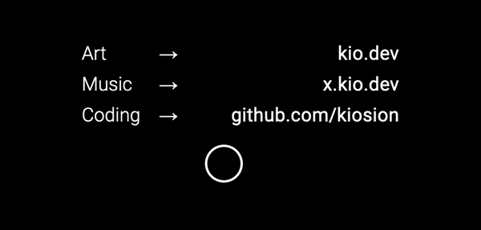

# minimal-cursor
A simple & clean CSS + JS custom cursor, initially created for my portfolio site.

## Known issues
If you're knowledgable in JS & know how to fix any of these issues, feel free to create a PR!

- Doesn't update relative position while scrolling the page
- Appears while using a mobile device
- Created in site's upper-left corner, slight delay before it snaps to the cursor location

## Demo
Head over to [kio.dev](https://kio.dev/) to see it in action!

